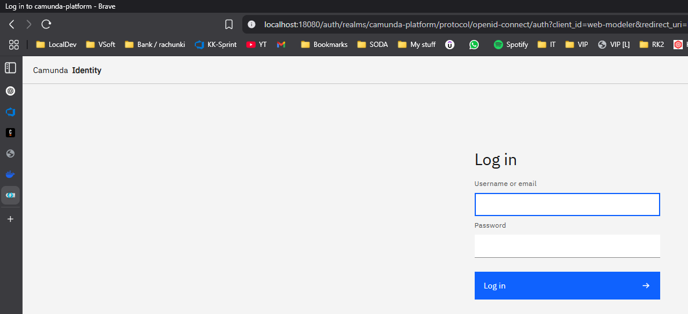

# Spis Treści

- [Camunda - opis platformy/wprowadzenie](Content/Camunda_info.md)
- [Instalacja Camundy - opis](#Camunda-instalacja)
    - [Instalacja pod Camunda8 Run](Content/Camunda_install_camunda_run.md)
    - [Instalacja pod kątem Docker Compose](Content/Camunda_install_docker.md)
    - [Instalacja modelera Camunda8](Content/Camunda_modeller_install.md)
- [Uruchomienie camunda](#camunda---uruchomienie)
    - [Uruchomienie - Camunda8 run](Content/Camunda_run.md)
    - [Uruchomienie - docker](Content/camunda_docker_run.md)
- [Adresy usług]()
    - [Camunda8 run urls](Content/Camunda_run_urls.md)
    - [Camunda8 docker urls](Content/Camunda_docker_urls.md)

- [Automatyzacja](#camunda---cli-helper)
    - [Szybkie uruchamianie Camunda z CLI - powershell](Content/Camunda_docker_powershell_done_quick.md)

## Camunda - instalacja

Dwa najpopularniejsze sposoby hostowania Camunda na systemie Windows:
* usługi jako procesy (JDK) : wykorzystanie aplikacji c8run
* usługi dostarczane via docker (docker compose)

Sposoby instalacji, uruchomienia opisane w odpowiednich rozdziałach: 
- [Instalacja pod Camunda8 Run](Content/Camunda_install_camunda_run.md)
- [Instalacja pod kątem Docker Compose](Content/Camunda_install_docker.md)

## Camunda - uruchomienie

Camuna może zostać uruchomiona na wiele sposobów. Dwa najpopularniejsze, opisane w tej dokumentacji to:
* uruchomienie platformy na zasadzie wzbudzenia odpowiednich procesów z wykorzystaniem narzędzia __c8run__ 
* docker (docker compose)
Obydwa sposoby skutkują uruchomieniem usług pod konkretnymi adresami:

  
Przykład

  

## Camunda - CLI Helper

W sekcji "Automatyzacja" opisano sposób na rozszerzenie możliwości powershella o polecenia "camunda", które ułatwiają nieco pracę z tą platformą.  
Wystarczy w konsoli PS wpisać "camunda" aby zobaczyć listę wspieranych komend. Rozwiązanie jest kompatybilne z hostowaniem Camunda via docker.
