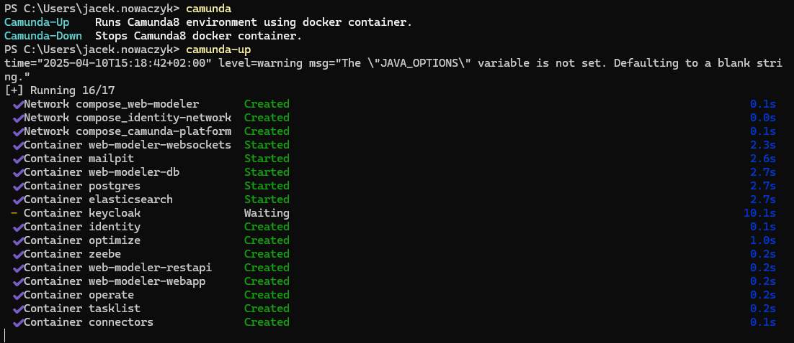

# Camunda - powershell


Aby ułatwić codzienną pracę, uruchamianie runtime Camunda8 przygotowano skrypt, który ułatwia uruchamianie/wyłączanie Camundy na potrzeby lokalnego developmentu. Skrypt działa w oparciu o podejście wykorzystujące docker compose do hostowania Camundy.


## Instrukcja

1) W katalogu: `C:\Users\{USER}\Documents`  utwórz katalog o nazwie `WindowsPowerShell` (jeśli nie istnieje).

2) W katalogu `C:\Users\{USER}\Documents\WindowsPowerShell` utwórz plik `profile.ps1` (o ile nie istnieje).

3) Wklej poniższy kod do `profile.ps1` przypisując do zmiennej `$camunda_docker_compose_dir_path` ścieżkę, w której rozpakowana została zawartość archiwum [docker compose](https://github.com/camunda/camunda-distributions/releases/download/docker-compose-alpha/docker-compose-alpha.zip)

```powershell
$camunda_docker_compose_dir_path = ""   # ścieżka do katalogu, w którym rozpakowano docker compose Camundy

function camunda-up {
	$current_loc = get-location;
	cd $camunda_docker_compose_dir_path
	docker compose up -d
	cd $current_loc;
}


function camunda-down {
	$current_loc = get-location;
	cd $camunda_docker_compose_dir_path
	docker compose down
	cd $current_loc;
}

function Camunda-Operate {
	Start-Process "http://localhost:8081"
}

function Camunda-Tasklist {
	Start-Process "http://localhost:8082"
}

function Camunda-Optimize {
	Start-Process "http://localhost:8083"
}

function Camunda-Identity {
	Start-Process "http://localhost:8084"
}

function Camunda-Modeler {
	Start-Process "http://localhost:8070"
}

function Camunda-Elastic {
	Start-Process "http://localhost:9200"
}

function Camunda-Urls {
	$urls = [System.Collections.Generic.List[System.Object]]::new()
	$urls.Add([PSCustomObject]@{Name="Operate"; Description="http://localhost:8081"})
	$urls.Add([PSCustomObject]@{Name="Tasklist"; Description="http://localhost:8082"})
	$urls.Add([PSCustomObject]@{Name="Optimize"; Description="http://localhost:8083"})
	$urls.Add([PSCustomObject]@{Name="Identity"; Description="http://localhost:8084"})
	$urls.Add([PSCustomObject]@{Name="Web Modeler"; Description="http://localhost:8070"})
	$urls.Add([PSCustomObject]@{Name="Elasticsearch"; Description="http://localhost:9200"})
	Format-CommandList -Commands $urls
}

function Camunda {
	$CommandList = [System.Collections.Generic.List[System.Object]]::new()
	$CommandList.Add([PSCustomObject]@{Name="Camunda-Up"; Description="Runs Camunda8 environment using docker container."})
	$CommandList.Add([PSCustomObject]@{Name="Camunda-Down"; Description="Stops Camunda8 docker container."})
	$CommandList.Add([PSCustomObject]@{Name="Camunda-Urls"; Description="Shows Camunda services urls."})
	$CommandList.Add([PSCustomObject]@{Name="Camunda-Operate"; Description="Launches Operate in browser."})
	$CommandList.Add([PSCustomObject]@{Name="Camunda-Tasklist"; Description="Launches Tasklist in browser."})
	$CommandList.Add([PSCustomObject]@{Name="Camunda-Optimize"; Description="Launches Optimize in browser."})
	$CommandList.Add([PSCustomObject]@{Name="Camunda-Identity"; Description="Launches Identity in browser."})
	$CommandList.Add([PSCustomObject]@{Name="Camunda-Modeler"; Description="Launches Modeler in browser."})
	$CommandList.Add([PSCustomObject]@{Name="Camunda-Elastic"; Description="Launches ElasticSearch in browser."})
	Format-CommandList -Commands $CommandList
}


function Format-CommandList {
    param(
        [Parameter(Mandatory=$true)]
        [System.Collections.Generic.List[System.Object]]$Commands
    )

    $MaxWidth = 0
    foreach ($Command in $Commands) {
        if ($Command.Name.Length -gt $MaxWidth) {
            $MaxWidth = $Command.Name.Length
        }
    }

    foreach ($Command in $Commands) {
        $FormattedName = $Command.Name.PadRight($MaxWidth)
        Write-Host -NoNewline -ForegroundColor Cyan "$FormattedName  "
        Write-Host -ForegroundColor White $Command.Description
    }
}
```
4) Zapisz zmiany

5) Uruchom nową instancję powershell w trybie admina. 

6) Od tej chwili do dyspozycji powinny być komendy "Camunda" odpowiedzialne za uruchamianie/ubijanie środowiska Camunda (docker).

Komendy:
```Powershell
camunda
camunda-up
camunda-down
```

Skutek użycia:



[Powrót](../Camunda_ReadMe.md)