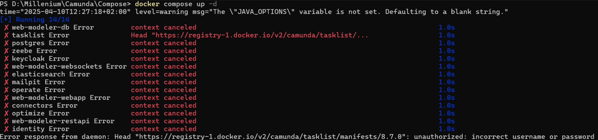

# Error response from daemon: Head "https://registry-1.docker.io/v2/camunda/web-modeler-websockets/manifests/8.7.0": unauthorized: incorrect username or password

Jeśli otrzymasz błąd wskazujacy na nieprawidłowe poświadczenia: 


* sprawdź czy konto docker zostało aktywowane (mail). Jeśłi niedawno rejestrowałeś konto na "firmowego maila" - przyszedł link aktywacyjny, po kliknieciu którego trzeba wypełnić formularz i kliknać save. Dopiero po tej czynności konto jest aktywowane.
* wywolaj logowanie do dockera z poziomu CLI: 
```powershell 
docker login
```
A nastepnie wciśnij enter i za pomocą przeglądarki zatwierdź poświadczenia

# ERROR: Elasticsearch 8.17.x cannot run with JDK 24+, but you are running JDK 24+36-3646, with exit code 64

Jeśli otrzymasz taki błąd, środowisko nie wstaje - prawdopodobnie zainstalowano JDK w wersji 24. Zrób downgrade do wersji 23.


[Powrót](../Camunda_ReadMe.md)